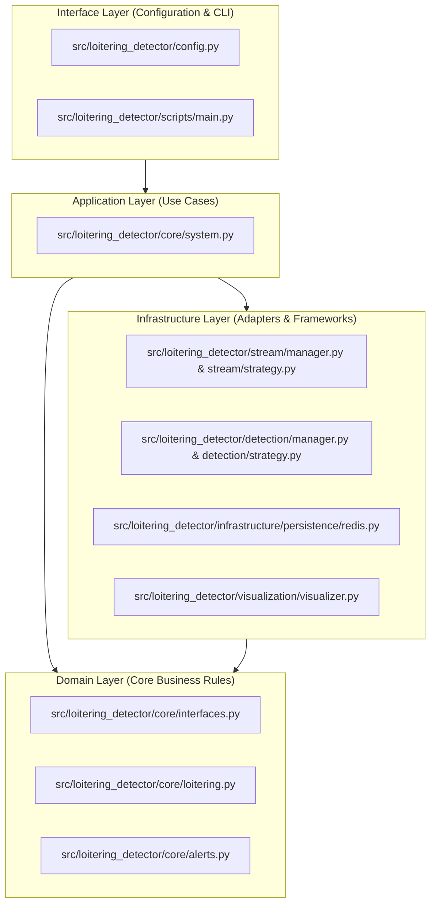
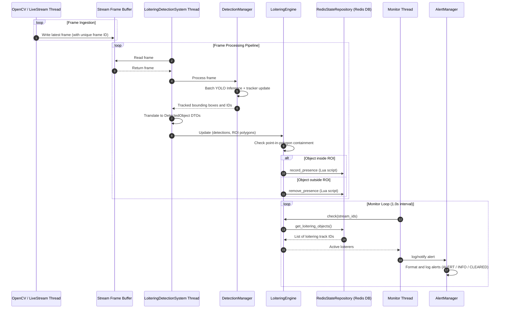

# Technical Architecture & System Design

The `loitering-detector` is a modular, high-performance computer vision pipeline designed to identify loitering behaviors in video streams. By decoupling the performance-critical, resource-heavy computer vision layers (object detection and tracking) from core domain business rules and state persistence layers, the system guarantees 100% offline testability, high maintainability, and clean separation of concerns.

---

## 🏗️ System Overview & Dependency Architecture

The system is structured around clean architectural principles. Dependencies flow strictly outward-in, meaning that inner domain rules are completely isolated from outer infrastructure details (such as specific computer vision libraries or database clients).



---

## 🧩 Component Breakdown

To enforce the separation of concerns, the codebase is divided into four distinct layers:

### 1. Domain Layer (Core Business Rules)
*   **Responsibility:** Defines the fundamental models, interfaces, and business logic for loitering detection.
*   **Key Components:**
    *   `src/loitering_detector/core/interfaces.py`: Exposes DTOs like `DetectedObject` and abstract interfaces like `LoiteringStateRepository` and `GeometryEngine`.
    *   `src/loitering_detector/core/loitering.py`: Implements `LoiteringEngine`, which coordinates loitering presence updates and checks against the repository and geometry engines.
    *   `src/loitering_detector/core/alerts.py`: Implements `AlertManager` to control alert lifecycles and throttle duplicate notifications.
*   **Boundary Policy:** This layer is written in pure Python. It has no knowledge of OpenCV (`cv2`), PyTorch, or Redis. This design permits complete offline unit testing without external mocks.

### 2. Infrastructure Layer (Adapters & Frameworks)
*   **Responsibility:** Provides concrete implementations of the abstract interfaces defined in the Domain layer and manages third-party frameworks.
*   **Key Components:**
    *   `src/loitering_detector/stream/manager.py` & `src/loitering_detector/stream/strategy.py`: Orchestrates multi-threaded video stream ingestion.
    *   `src/loitering_detector/detection/manager.py` & `src/loitering_detector/detection/strategy.py`: Manages model inference and state tracking for multi-object tracking (YOLO, BYTETracker, BoT-SORT).
    *   `src/loitering_detector/infrastructure/persistence/redis.py`: Implements `RedisStateRepository` using atomic Lua scripts to synchronize tracking states.
    *   `src/loitering_detector/visualization/visualizer.py`: Provides local display and overlay rendering.

### 3. Application Layer (Use Cases)
*   **Responsibility:** Coordinates the flow of data between the Infrastructure and Domain layers.
*   **Key Components:**
    *   `src/loitering_detector/core/system.py`: Implements `LoiteringDetectionSystem`, which coordinates thread lifecycles, runs the main video processing loop, reads frames, triggers detection and tracking, and polls the alert scheduler.

### 4. Interface Layer (User Interaction & Configuration)
*   **Responsibility:** Validates external inputs and routes user commands.
*   **Key Components:**
    *   `src/loitering_detector/config.py`: Loads and sanitizes YAML configurations using Pydantic, acting as a gateway for execution params.
    *   `src/loitering_detector/scripts/main.py`: Acts as the command-line interface entry point.

---

## 📂 Directory Layout Map

```
src/
└── loitering_detector/          # Core package root
    ├── core/                    # Domain logic & orchestrators
    │   ├── alerts.py            # Alert throttling and manager
    │   ├── interfaces.py        # Domain DTOs and abstract interfaces
    │   ├── loitering.py         # Loitering presence calculation engine
    │   └── system.py            # Central thread coordinator and use case
    ├── infrastructure/          # Outward adapters
    │   ├── geometry.py          # Containment checking via OpenCV
    │   └── persistence/         # Redis and InMemory repository implementations
    ├── detection/               # Computer Vision models and trackers
    │   ├── manager.py           # Multi-stream detection coordinator
    │   └── strategy.py          # YOLO and tracker strategy wrappers
    ├── stream/                  # Live camera and video stream ingestion
    │   ├── manager.py           # Multi-stream ingestion orchestrator
    │   └── strategy.py          # Threaded ingestion implementations
    ├── visualization/           # UI overlay drawer
    │   └── visualizer.py        # Local GUI rendering
    ├── config.py                # Pydantic configuration schemes
    └── scripts/                 # Executable entry points
tests/                           # Test suite root
├── unit/                        # Mock-free domain and component unit tests
├── integration/                 # Integration tests with live resources
└── e2e/                         # System validation flows
```

---

## 🔄 Runtime Flow & Pipeline Sequence

The pipeline orchestrates data transit across multiple threads and services to maintain high ingestion throughput and prevent frame-processing latency:



---

## 🧠 State Persistence & Atomic Redis Mechanics

To enable horizontal scaling and resilience against process restarts, the loitering tracking state is externalized. A stateless ingestion worker writes state updates directly to Redis, while an independent alerting thread polls state trends to trigger notifications.

### 1. State Machine Transitions
For any given tracked object inside a specific camera stream, the loitering engine transitions the object through the following states:

*   **Absent:** The object is outside the defined Region of Interest (ROI). No state is stored.
*   **Present:** The object enters the ROI. The system registers its entry timestamp in Redis.
*   **Loitering:** The continuous dwell time of the object inside the ROI exceeds the configured duration threshold (`now - start_time >= threshold`).
*   **Cooldown:** The object exits the ROI. The heartbeat marker is removed, but the initial entry timestamp is retained for a configurable grace period (cooldown) to handle tracking fragmentation. If the tracker re-identifies the object before the cooldown expires, the initial entry timestamp is preserved, preventing duplicate alerts.

### 2. Redis Key Schema
Persistence is managed using three structured Redis key spaces:

*   **Track Key:** `state:loitering:{stream_id}:{track_id}`
    *   *Type:* String
    *   *Value:* Epoch timestamp of initial ROI entry.
    *   *TTL:* Configured threshold + cooldown duration.
*   **Active Sentinel:** `state:loitering:{stream_id}:{track_id}:active`
    *   *Type:* String (always set to `"1"`)
    *   *Value:* Heartbeat token signifying immediate presence in the current frame.
    *   *TTL:* Cooldown duration (expires when object leaves ROI).
*   **Stream Index:** `state:loitering:{stream_id}:index`
    *   *Type:* Set
    *   *Value:* Unordered members tracking active keys in the stream. Used to query presence status efficiently.

### 3. Atomic Script Operations
To avoid race conditions, network roundtrip overhead, and stale data drift, `RedisStateRepository` delegates modifications to pre-registered Lua scripts executed atomically:

*   **`lua_record` Script:** Runs whenever an object is detected inside the ROI:
    1.  Uses `SET NX` to set the Track Key with the current epoch timestamp. This preserves the original entry time and ignores overwrites on subsequent frames.
    2.  Sets the Track Key's expiration TTL to `threshold + cooldown` using `EXPIRE`.
    3.  Inserts the Track Key name into the Stream Index using `SADD`.
    4.  Creates/renews the Active Sentinel key with a TTL set to `cooldown`.
*   **`lua_remove` Script:** Runs when an object leaves the ROI:
    1.  Deletes the Active Sentinel key using `DEL`.
    2.  Removes the Track Key from the Stream Index set using `SREM`.
    3.  Queries the remaining TTL of the Track Key using `TTL`. If the key is persistent or its TTL is greater than the cooldown duration, it sets the expiration explicitly to `cooldown` via `EXPIRE`, scheduling it for cleanup.

---

## 🧠 Key Design Decisions

The structural choices of the `loitering-detector` system were guided by performance requirements, robust state recovery, and testability. The primary architecture design records (ADRs) include:

### ADR 1: Multi-Object Tracking Engine (BYTETrack / BoT-SORT)
*   **Context:** Bounding boxes output by YOLO inference represent isolated, single-frame detections. Without tracking ID persistence, the system cannot measure the dwell time of individual targets.
*   **Decision:** Integrate abstract, uniform tracking wrappers around BYTETrack and BoT-SORT algorithms.
*   **Trade-off:** BYTETrack associates targets using simple Kalman filter predictions, yielding extremely fast CPU processing times. BoT-SORT incorporates camera motion compensation, reducing track degradation in shaking cameras but introducing higher CPU/GPU overhead. Using a segregated, per-stream tracking manager prevents ID collisions across multiple cameras.

### ADR 2: Decoupled Spatial Engine (`GeometryEngine`)
*   **Context:** Calculating polygonal Region of Interest (ROI) containment is a spatial operation. Tying it directly to OpenCV (`cv2`) creates hard dependencies that block unit testing in headless CI environments.
*   **Decision:** Extract spatial logic behind a `GeometryEngine` interface, implementing it via OpenCV (`OpenCVGeometryEngine`) using `cv2.pointPolygonTest`.
*   **Trade-off:** Decouples OpenCV from core domain rules. This enables mock-free, high-speed unit tests of the loitering algorithm using an inline stub geometry engine without any system-specific binary dependencies.

### ADR 3: Stateless Ingestion Worker Pattern (Redis Persistence)
*   **Context:** Tracking state maintained locally in memory is volatile. A worker crash causes immediate loss of tracking metrics and triggers duplicate alerts. In addition, local state prevents scaling worker pipelines independently from alert managers.
*   **Decision:** Externalize tracking states using `RedisStateRepository`, relying on pre-registered Redis Lua scripts to execute updates.
*   **Trade-off:** Workers are stateless. If a worker process exits, a fresh instance resumes tracking instantly by querying current timestamps from Redis. This introduces a requirement for a running Redis database, which is abstractly stubbed in tests via `InMemoryStateRepository`.

---

## ⚖️ System Scaling Limits & Constraints

While modular, the single-process orchestration pattern is subject to physical hardware constraints:

*   **Ingestion Bottlenecks:** The stream manager spawns a dedicated frame capture thread per camera stream using OpenCV. It is bound by CPU core performance. Processing slowdowns in downstream inference loops will lead to frame dropping inside the single-frame buffer.
*   **GPU VRAM Allocations:** YOLO batch inference performance scales with frame batch size. However, higher camera counts and larger batches will consume significant GPU VRAM. Exceeding hardware memory limits causes CUDA Out-Of-Memory (OOM) failures.
*   **CPU Fallback Performance:** In environments lacking a CUDA GPU, PyTorch falls back to CPU-based inference. This results in severe frame rate drops. Production setups must enable GPU-optimized extras or adjust ingestion frame rates to match CPU processing capacity.
*   **Single-Node Limitations:** Components communicate via in-memory thread buffers. Scaling beyond single-node GPU bounds requires distributing ingestion frames to an external message queue (e.g., RabbitMQ or Kafka) to orchestrate multi-worker GPU inference.
