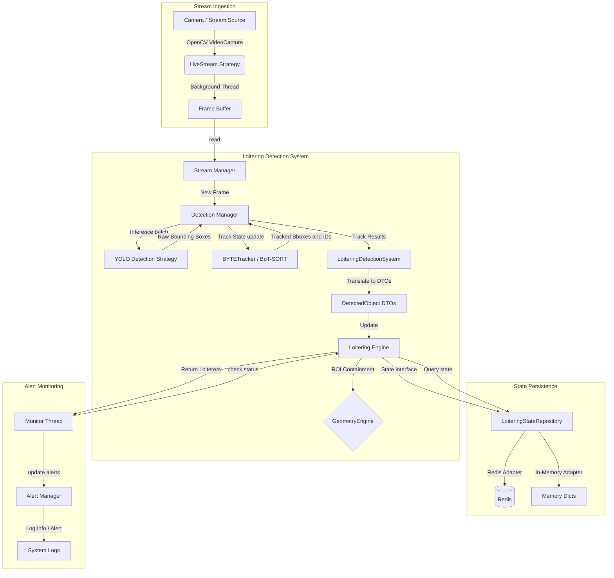

# Technical Architecture & Developer Context

This document provides a comprehensive blueprint of the `loitering-detector` system architecture, design decisions, repository organization, and development guidelines.

## 🏗️ System Architecture & Data Flow

The `loitering-detector` system is designed as a pipeline that runs frames through Object Detection and Multi-Object Tracking (MOT), translates raw results into domain DTOs, evaluates containment using a decoupled geometry engine, persists state in a database or memory repository, and monitors alerts on a background thread.

### High-Level Data Flow



### 1. Ingestion Pipeline
Each video stream is managed by `StreamManager` (`src/loitering_detector/stream/manager.py`). It delegates ingestion to a concrete `StreamStrategy` (currently `LiveStream` in `src/loitering_detector/stream/strategy.py`), which runs a background thread. This thread continuously pulls frames from the video source using OpenCV and saves the latest frame to a thread-safe single-frame buffer. The `read()` method uses unique frame IDs to ensure that a single frame is never processed twice by the detection loop.

### 2. Detection & Tracking Pipeline
The `DetectionManager` (`src/loitering_detector/detection/manager.py`) coordinates batch inference. It passes a batch of frames from all active streams to `YOLODetection` (`src/loitering_detector/detection/strategy.py` - ultralytics YOLO) to run inference in a single forward pass, optimizing GPU utilization.
After receiving raw bounding boxes, the `DetectionManager` updates a unique tracker instance (from `TRACKER_REGISTRY` mapping to `BYTETracker` or `BOTSORT`) for each stream. This independent tracking state prevents track ID pollution across different cameras.

### 3. Loitering State Engine & Persistence
The `LoiteringDetectionSystem` coordinate loop parses raw bounding boxes from the `DetectionManager`'s results, scales the coordinates, and converts them to generic, framework-agnostic `DetectedObject` data transfer objects (defined in `interfaces.py`).
These objects are passed to the `LoiteringEngine` (`src/loitering_detector/core/loitering.py`) which delegates containment checks and state updates to decoupled adapters:
* **Containment Check:** A point at the bottom-center of the object bounding box (e.g., foot position `(x_center, y_bottom)`) is evaluated against the ROI polygon using an injected `GeometryEngine` strategy (concrete OpenCV implementation utilizing `cv2.pointPolygonTest`).
* **State Operations:** The engine calls the injected `LoiteringStateRepository` strategy (`record_presence` or `remove_presence`) to persist object status. When configured with the `RedisStateRepository`, updates are executed atomically via registered Lua scripts on Redis. Alternatively, unit tests swap this persistence layer with the `InMemoryStateRepository` using local Python dictionary tracking.

### 4. Alerting & Monitoring
A background thread (`_monitor_loop`) runs inside `LoiteringDetectionSystem` (`src/loitering_detector/core/system.py`). Every 1.0 second, it polls the `LoiteringEngine` to check which track IDs have exceeded the loitering threshold (e.g., `current_time - start_time >= threshold`).
The active loiterers are passed to `AlertManager` (`src/loitering_detector/core/alerts.py`), which manages alert lifecycles:
* **`[ALERT]`** logged when a new object starts loitering.
* **`[INFO]`** logged as a recurring update if the object remains beyond the configured alert interval.
* **`[CLEARED]`** logged when the object leaves the stream or cooldown expires.

---

## 📂 Repository Structure & Component Map

The project is structured as a clean, component-oriented Python package.

```
loitering_detector/
├── .github/                       # GitHub Actions workflows
├── docker/                        # Dockerfiles for production and testing
│   └── worker.Dockerfile          # Multistage builder for worker and tests
├── src/
│   └── loitering_detector/        # Core application package
│       ├── __init__.py            # Package entry point
│       ├── config.py              # Root SystemConfig schema and loader
│       ├── core/                  # Orchestration and state management
│       │   ├── __init__.py
│       │   ├── alerts.py          # AlertManager notification logging
│       │   ├── interfaces.py      # [NEW] Domain interfaces and DTOs
│       │   ├── loitering.py       # Decoupled LoiteringEngine
│       │   └── system.py          # LoiteringDetectionSystem central coordinator
│       ├── detection/             # CV Inference and MOT trackers
│       │   ├── __init__.py
│       │   ├── config.py          # Config schemas for YOLO, BYTETrack, BoT-SORT
│       │   ├── manager.py         # Multi-stream tracker management
│       │   └── strategy.py        # Abstract Strategy & YOLO implementations
│       ├── infrastructure/        # [NEW] Concrete infrastructure adapters
│       │   ├── __init__.py
│       │   ├── geometry.py        # OpenCVGeometryEngine containment check
│       │   └── persistence/       # State repository persistence implementations
│       │       ├── __init__.py
│       │       ├── in_memory.py   # InMemoryStateRepository for mock-free tests
│       │       └── redis.py       # RedisStateRepository executing Lua scripts
│       ├── scripts/               # Executable script entrypoints
│       │   ├── __init__.py
│       │   ├── debug.py           # Launcher for DebugVisualizer
│       │   ├── main.py            # CLI Router (run vs debug commands)
│       │   └── run.py             # Headless execution launcher
│       ├── stream/                # Video frame ingestion
│       │   ├── __init__.py
│       │   ├── config.py          # StreamConfig model validation
│       │   ├── manager.py         # Threaded StreamManager orchestration
│       │   ├── strategy.py        # Abstract StreamStrategy & LiveStream source
│       │   └── utils.py           # Thread-safe environment variables locks
│       └── visualization/         # UI rendering tools (local testing only)
│           ├── __init__.py
│           └── visualizer.py      # DebugVisualizer drawing overlays via cv2
├── tests/                         # Project tests
│   ├── unit/                      # Unit tests
│   │   └── backend/               # Unit tests covering backend components
│   │       ├── alerts/            # Test cases for AlertManager
│   │       ├── config/            # Test cases for configuration loading
│   │       ├── core/              # Test cases for System and Loitering engine
│   │       ├── detection/         # Test cases for inference and tracking
│   │       ├── stream/            # Test cases for stream manager & LiveStream
│   │       └── visualization/     # Test cases for local visualizer
│   ├── integration/               # Integration tests
│   ├── e2e/                       # End-to-end tests
│   └── fixtures/                  # Test data and assets
├── pyproject.toml                 # Package metadata and tool configurations
├── uv.lock                        # Locked dependencies
└── system_config.example.yml      # Local development configuration template
```

---

## 🛠️ Developer Setup & Workflows

This project uses modern Python development tooling centered around `uv`, `poethepoet`, and `pre-commit`.

### 1. Prerequisites
* Python 3.12 or 3.13
* Redis Server (running locally or via Docker, only required for integration/E2E testing or production; unit tests run fully offline)

### 2. Environment Setup
Install dependencies and build the virtual environment using `uv`:
```bash
# Sync all dependencies including dev tools and headless/gui options
uv sync --all-extras
```

### 3. Git Pre-Commit Hooks
We use `pre-commit` to run local validations automatically before changes are committed.
Install the git hooks with:
```bash
uv run pre-commit install
```
You can also trigger them manually on all files:
```bash
uv run pre-commit run --all-files
```

### 4. Task Execution
We use `poethepoet` (aliased as `poe`) as our task runner. The following tasks are configured in `pyproject.toml`:

* **Linting Checks:**
  ```bash
  uv run poe lint
  ```
  Runs `ruff check .` to check for style violations.

* **Code Formatting:**
  ```bash
  uv run poe format
  ```
  Runs `black .` to format the python codebase in place.

* **Format Validation:**
  ```bash
  uv run poe format-check
  ```
  Runs `black --check .` to verify files are formatted without modifying them (used in CI).

* **Static Type Checking:**
  ```bash
  uv run poe typecheck
  ```
  Runs `mypy src` to perform strict type assertions.

* **Unit Testing:**
  ```bash
  uv run poe unit-test
  ```
  Runs `pytest tests/unit` with coverage tracking on the `src/` directory.

* **CI Pipeline Check:**
  ```bash
  uv run poe ci
  ```
  Runs all checks sequentially (`lint` -> `format-check` -> `typecheck` -> `unit-test`) to validate changes before pushing.

---

## 🧠 Key Design Decisions

### 1. Redis State Persistence
Instead of keeping tracking states in local application memory, we persist loitering metrics in Redis.
* **Why:** This decouples the computer vision processing loop (which runs at high frame rates on GPU nodes) from the monitoring alerts scheduler (which runs on a lightweight monitoring thread). It also makes the worker stateless: if the application crashes, loitering tracking state is not lost because timestamps remain in Redis.

### 2. Atomic Updates via Lua Scripts
To prevent race conditions, network latency overhead, and partial updates when logging tracking states, `LoiteringEngine` registers two Lua scripts on initialization:
* **`lua_record`:** Atomically sets the object start timestamp (`SET nx`), sets/renews the key expiration to threshold + cooldown, adds the object to the stream's member set (`SADD`), and updates an active status sentinel key with a TTL equal to the cooldown.
* **`lua_remove`:** Atomically deletes the active status sentinel key, removes the track key from the stream's active member index (`SREM`), and updates the tracking key's expiration to the cooldown duration so it persists briefly before deletion.

### 3. Headless vs. GUI Separation
Production systems typically run headless on servers, whereas developers need GUI windows to calibrate camera regions of interest.
* **Solution:** We separate these dependencies using Pydantic group extras: `[headless]` installs `opencv-python-headless`, and `[gui]` installs full `opencv-python`. The `cv2` module is lazy-imported in the `debug` runner module to allow headless environments to import scripts without throwing GUI-related runtime library exceptions.

### 4. Thread-Safe FFmpeg Environment Controls
Some lower-level FFmpeg parameters (such as `reconnect`, `reconnect_streamed`, and `reconnect_delay_max`) are not exposed as standard properties via OpenCV's `cv2.VideoCapture.set()` method.
* **Solution:** They must be passed as an environment variable `OPENCV_FFMPEG_CAPTURE_OPTIONS`. To prevent multi-threaded streams from writing conflicts, `LiveStream` wraps VideoCapture instantiation in `opencv_ffmpeg_capture_options_context` (`src/loitering_detector/stream/utils.py`), which uses a global thread lock to safely modify and restore the environment variables.

---

## 🧪 Testing Guidelines

### 1. Test Architecture
Tests are divided into `unit/`, `integration/`, and `e2e/` directories.
* `tests/unit/backend/` covers internal logic without invoking actual GPU models or external Redis servers.

### 2. Mocking Strategy
* **Video Frames:** We use the `mock_frame` fixture for simple dummy frames. For more complex/scenarios, we use `synthetic_frame_generator` (which wraps the `generate_synthetic_frame` utility) to build mock NumPy RGB arrays with custom colors and shapes (e.g. circles or rectangles) to simulate objects in video streams.
* **Model Weight Files:** Tests utilize the `mock_weights_file` fixture to write dummy weights files. Alternatively, the `create_mock_weights` fixture is available to dynamically create mock weights files at any specified filepath (and handles deletion cleanup automatically after tests run).
* **External Systems (Redis/Inference):** Unit tests utilize `pytest-mock` to stub calls to the `ultralytics.YOLO` model backend and a shared `mock_redis` fixture for `RedisStateRepository` tests. In addition, an autouse `stub_redis_network` fixture globally monkeypatches `redis.Redis` during all unit tests as a safety net, guaranteeing no network calls are ever made to a live Redis database.
* **Mock-Free Domain Unit Tests:** Due to domain isolation, `LoiteringEngine` is unit tested offline without any database mocks or OpenCV dependencies by injecting the `InMemoryStateRepository` and a simple stub geometry engine (defined locally in the test files). This prevents fragile mock setups and ensures tests run extremely fast and reliably.

### 3. Local Verification Commands
To execute the tests:
```bash
uv run pytest tests/unit
```

### 4. Dockerized Test Runner
To execute tests in an isolated environment mimicking production:
```bash
docker-compose -f docker-compose.test.yml up --build --abort-on-container-exit
```

---

## 🎯 Known Limitations & Roadmap

* **Single-Node Inference:** Currently, batch inference is designed for execution within a single python process. Future versions plan to separate stream frames ingestion to an AMQP queue (e.g., RabbitMQ) to allow multi-node GPU worker scaling.
* **Tracking Disconnects:** If a camera stream disconnects and reconnects, tracker tracking IDs for that stream are reset. Adding ReID feature vectors (from tracker engines using deep ReID models) will improve cross-reconnection re-identification.
* **GPU Memory Tuning:** In multi-stream production scenarios, the Ultralytics model resource allocation needs to be tuned dynamically. Explicit options for PyTorch CUDA cache clearing should be introduced.
